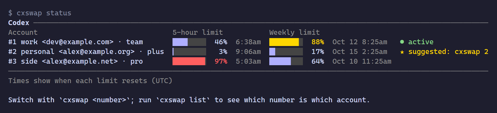

# agentswap

English | [繁體中文](README.zh-TW.md) | [简体中文](README.zh-CN.md)

[](https://github.com/WellWells/agentswap/actions/workflows/ci.yml)
[](https://github.com/WellWells/agentswap/releases/latest)
[](LICENSE)

A fast, compact, privacy-first account switcher for Codex, Claude Code and the Antigravity CLI.

With more than one subscription, copying the login file back and forth only lasts a few days: the saved copy expires, and signing in again logs out the account you were using. agentswap keeps every saved account signed in, shows how much of each account's limits is left, and switches with one command. Only the login changes; the rest of your agent's settings stay as they are. Your tokens stay on your machine, encrypted.



One small program for macOS, Linux and Windows. Nothing else to install, nothing running in the background.

agentswap was inspired by [claude-swap](https://github.com/realiti4/claude-swap) (`cswap`). It brings the same idea to Codex and the Antigravity CLI, keeps every saved account encrypted so only your user on this computer can open it, and comes as one program with nothing else to install. If you are moving over, `ccswap import` brings your accounts with you.

## Install

macOS / Linux:

```sh
curl -fsSL https://github.com/WellWells/agentswap/releases/latest/download/install.sh | sh
```

Windows (PowerShell):

```powershell
irm https://github.com/WellWells/agentswap/releases/latest/download/install.ps1 | iex
```

Homebrew (macOS / Linux):

```sh
brew install wellwells/tap/agentswap
```

The scripts install to `~/.local/bin` (Windows: `%LOCALAPPDATA%\agentswap\bin`, added to your PATH) together with the `cxswap`, `ccswap` and `agswap` commands. There is no security prompt to click through. `AGENTSWAP_VERSION=v1.0.0` pins a version, `AGENTSWAP_INSTALL_DIR` changes the folder.

With Go: `go install github.com/WellWells/agentswap/cmd/agentswap@latest`, then `agentswap link`.

`agentswap update` installs the latest release (Homebrew: `brew upgrade agentswap`). When a new release is out, agentswap mentions it in one line.

## Uninstall

```sh
agentswap unlink                  # remove cxswap, ccswap and the other commands
rm ~/.local/bin/agentswap         # or: brew uninstall agentswap
rm -rf ~/.agentswap               # saved accounts
```

On Windows, delete `%LOCALAPPDATA%\agentswap` and remove its `bin` folder from your user PATH. On macOS and Linux the encryption key stays in the keychain under the name `agentswap`; delete it there if you want nothing left behind.

## Getting started

### Codex

```sh
cxswap add work          # save the account you are signed in to
cxswap login personal    # sign in to another account and save it
cxswap list
```

```text
Codex accounts

  #  Account                      Plan  Switch with
  1  work <dev@example.com>       team  ● active
  2  personal <alex@example.org>  plus  cxswap 2
  3  side <alex@example.net>      pro   cxswap 3

Switch with `cxswap <number>`. Numbers follow the order accounts were added and shift up when one is removed.
You can also use an alias or email (`cxswap <alias|email>`); `cxswap -` switches back to the previous account.
```

```sh
cxswap 2                 # switch to #2
cxswap -                 # and back
```

Restart Codex after switching; if it is still running, `cxswap` offers to close it. Once an account is saved, add more with `cxswap login` rather than `codex login` or `codex logout`, which sign out the account you are using. Codex set to keep its login in the system keyring is not supported yet.

### Claude Code

```sh
ccswap add work          # save the account you are signed in to
ccswap status
ccswap 2                 # running sessions pick it up on their next request
```

Sign in to other accounts with `/login` inside Claude Code, then `ccswap add`. Only the login is swapped; your settings and MCP servers stay as they are. Claude subscription logins only, not API keys.

Coming from claude-swap:

```sh
ccswap import            # choose 1) cswap, or run `ccswap import 1`
ccswap list              # check that every account came over
cswap purge              # then remove the copies claude-swap kept
```

Aliases come along, and accounts you already saved are skipped. Stop using cswap afterwards: both tools would keep refreshing the same logins and sign each other out.

### Antigravity CLI

```sh
agswap add work          # save the account you are signed in to
agswap list
agswap 2                 # offers to close running agy first
```

To add another account, run `/logout` in agy, sign in to the other account and run `agswap add`. Logging out does not affect saved accounts. agy only picks up a new login when it starts, so `agswap` asks to close every running agy, `agy remote-control` included, and cancels the switch if you say no. The desktop app is not supported yet.

## Commands

| Agent | Commands |
|---|---|
| OpenAI Codex | `cxswap`, `codexswap`, `agentswap codex` |
| Claude Code | `ccswap`, `claudeswap`, `agentswap claude` |
| Antigravity CLI (`agy`) | `agswap`, `agyswap`, `agentswap antigravity` |

Every agent has the same commands. `<account>` is the number from `list`, an alias, an email, or any unique part of one.

| Command | |
|---|---|
| `cxswap status [account]` | limits of every saved account, or just one, and which account has the most room left (`usage` is the same) |
| `cxswap list` | numbers, aliases, plans and which account is active |
| `cxswap <account>` | switch (also `cxswap switch <account>`); `--yes` closes running sessions without asking |
| `cxswap -` | switch back to the previous account |
| `cxswap add [alias]` | save the account you are signed in to |
| `cxswap login [alias]` | Codex only: sign in to another account and save it |
| `ccswap import` | Claude Code only: import accounts from claude-swap |
| `cxswap alias <account> [name]` | set an alias, or clear it |
| `cxswap rm <account>` | forget a saved account (it stays signed in) |
| `agentswap status` | all agents at once |
| `agentswap lang [language]` | English (`en`), Traditional Chinese (`zh-TW`) or Simplified Chinese (`zh-CN`); `auto` follows the system |

Run any command without arguments for its help.

| Environment variable | |
|---|---|
| `AGENTSWAP_HOME` | where saved accounts live (default `~/.agentswap`) |
| `CODEX_HOME`, `CLAUDE_CONFIG_DIR` | respected the same way the agents respect them |
| `AGENTSWAP_LANG` | message language, overrides `agentswap lang` |
| `AGENTSWAP_NO_UPDATE_CHECK` | set to anything to skip the release check |
| `NO_COLOR` | plain output |

## Privacy

agentswap has no server, no sign-up and no telemetry. Here is everything it does with your logins:

- **On your computer**, saved accounts live in `~/.agentswap`, encrypted with a key that only your user on this computer can use, kept by the system: Windows itself, the Keychain on macOS, the keyring on Linux. Copied to another computer, they cannot be opened. On Linux without a keyring, agentswap uses a key file instead and tells you so.
- **On the network**, each token goes only to the company that issued it, to read usage and keep the login fresh:

  | Agent | Hosts |
  |---|---|
  | Codex | `chatgpt.com`, `auth.openai.com` |
  | Claude Code | `api.anthropic.com`, `platform.claude.com` |
  | Antigravity CLI | `cloudcode-pa.googleapis.com`, `oauth2.googleapis.com` |

  The only other connection is the release check on `github.com`, which carries no token. `AGENTSWAP_NO_UPDATE_CHECK=1` turns it off.
- **Before replacing your current login**, agentswap keeps an encrypted backup of it. Only the latest five are kept.
- **Open source** under the MIT License, with no third-party code.

## Contributing

Questions, bug reports and pull requests are welcome. The [bug report form](https://github.com/WellWells/agentswap/issues/new?template=bug_report.yml) asks for the details that usually matter, and [feature requests](https://github.com/WellWells/agentswap/issues/new?template=feature_request.yml) are the place to suggest another agent. See [CONTRIBUTING.md](CONTRIBUTING.md) for building and testing, and [SECURITY.md](SECURITY.md) for reporting anything that could expose tokens. Writing in English or Chinese is fine.

## License

Copyright 2026 [WellsTsai](https://wellstsai.com). [MIT License](LICENSE), see [NOTICE](NOTICE).

agentswap is not affiliated with OpenAI, Anthropic or Google.
