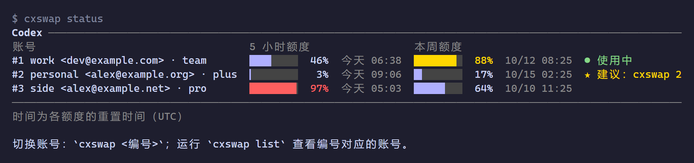

# agentswap

[English](README.md) | [繁體中文](README.zh-TW.md) | 简体中文

[](https://github.com/WellWells/agentswap/actions/workflows/ci.yml)
[](https://github.com/WellWells/agentswap/releases/latest)
[](LICENSE)

快速、轻巧、隐私优先的账号切换工具，支持 Codex、Claude Code 和 Antigravity CLI。

有好几个订阅时，把登录文件复制来复制去撑不了几天：保存的那份很快就过期，重新登录又会把原来在用的账号登出。agentswap 让每个已保存的账号都保持登录，显示每个账号的额度还剩多少，一条命令切换。只换登录，agent 的其他配置都不动。token 只留在你的电脑上，加密保存。



一个小程序，支持 macOS、Linux、Windows。不用另外安装任何东西，也不常驻后台。

agentswap 的灵感来自 [claude-swap](https://github.com/realiti4/claude-swap)（`cswap`），把同样的做法扩展到 Codex 和 Antigravity CLI。每个已保存的账号都加密保存，只有这台电脑上的你能打开；整个工具就是一个程序，不需要另外安装其他东西。如果你要迁移过来，`ccswap import` 可以把账号一起带过来。

## 安装

macOS / Linux：

```sh
curl -fsSL https://github.com/WellWells/agentswap/releases/latest/download/install.sh | sh
```

Windows（PowerShell）：

```powershell
irm https://github.com/WellWells/agentswap/releases/latest/download/install.ps1 | iex
```

Homebrew（macOS / Linux）：

```sh
brew install wellwells/tap/agentswap
```

安装脚本会装到 `~/.local/bin`（Windows 是 `%LOCALAPPDATA%\agentswap\bin`，并加入 PATH），同时创建 `cxswap`、`ccswap`、`agswap` 等命令，不会弹出需要手动放行的安全提示。`AGENTSWAP_VERSION=v1.0.0` 可以指定版本，`AGENTSWAP_INSTALL_DIR` 可以更改安装目录。

用 Go 安装：`go install github.com/WellWells/agentswap/cmd/agentswap@latest`，再运行 `agentswap link`。

`agentswap update` 会更新到最新版（Homebrew 用 `brew upgrade agentswap`）。有新版本时，agentswap 会用一行字提醒你。

## 卸载

```sh
agentswap unlink                  # 移除 cxswap、ccswap 等命令
rm ~/.local/bin/agentswap         # 或：brew uninstall agentswap
rm -rf ~/.agentswap               # 已保存的账号
```

Windows 请删除 `%LOCALAPPDATA%\agentswap`，并把其中的 `bin` 目录从用户 PATH 中移除。macOS 和 Linux 的加密密钥还留在钥匙串里，名称是 `agentswap`，想清理干净的话请一并删除。

## 快速上手

### Codex

```sh
cxswap add work          # 保存当前登录的账号
cxswap login personal    # 登录另一个账号并保存
cxswap list
```

```text
Codex 账号

  编号  账号                         套餐  切换命令
  1     work <dev@example.com>       team  ● 使用中
  2     personal <alex@example.org>  plus  cxswap 2
  3     side <alex@example.net>      pro   cxswap 3

切换账号：`cxswap <编号>`。编号按添加顺序排列，删除账号后，后面的编号会依次前移。
也可以用别名或 email 切换（`cxswap <别名|email>`）；`cxswap -` 切回上一个账号。
```

```sh
cxswap 2                 # 切换到 #2
cxswap -                 # 再切回来
```

切换后请重启 Codex；如果 Codex 还在运行，`cxswap` 会询问是否帮你关闭。账号保存之后，请用 `cxswap login` 添加账号，不要用 `codex login` 或 `codex logout`，这两个命令会把当前在用的账号登出。Codex 设置为把登录信息存在系统钥匙串时，目前还不支持。

### Claude Code

```sh
ccswap add work          # 保存当前登录的账号
ccswap status
ccswap 2                 # 运行中的会话会在下一个请求改用新账号
```

其他账号请在 Claude Code 里用 `/login` 登录，再运行 `ccswap add`。切换只换登录，你的配置和 MCP 服务器都不会动。只支持 Claude 订阅登录，不支持 API key。

从 claude-swap 迁移过来：

```sh
ccswap import            # 选 1) cswap，或直接运行 `ccswap import 1`
ccswap list              # 确认账号都迁移过来了
cswap purge              # 再移除 claude-swap 留下的副本
```

别名会一起带过来，已经保存过的账号会跳过。迁移之后请不要再用 cswap：两个工具会刷新同一组登录，互相把对方登出。

### Antigravity CLI

```sh
agswap add work          # 保存当前登录的账号
agswap list
agswap 2                 # 会先询问是否关闭运行中的 agy
```

要添加账号，在 agy 里运行 `/logout`，登录另一个账号后再运行 `agswap add`。退出登录不会影响已保存的账号。agy 只在启动时读取登录信息，所以 `agswap` 会询问是否关闭所有运行中的 agy（包括 `agy remote-control`），选否就取消切换。桌面版目前还不支持。

## 命令

| Agent | 命令 |
|---|---|
| OpenAI Codex | `cxswap`、`codexswap`、`agentswap codex` |
| Claude Code | `ccswap`、`claudeswap`、`agentswap claude` |
| Antigravity CLI（`agy`） | `agswap`、`agyswap`、`agentswap antigravity` |

每个 agent 的命令都一样。`<account>` 可以是 `list` 里的编号、别名、邮箱，或其中任何不重复的片段。

| 命令 | 说明 |
|---|---|
| `cxswap status [account]` | 显示所有已保存账号的额度，或只显示一个，并标出剩余额度最多的账号（`usage` 相同） |
| `cxswap list` | 编号、别名、套餐，以及当前使用中的账号 |
| `cxswap <account>` | 切换（也可以写 `cxswap switch <account>`）；加 `--yes` 不询问直接关闭运行中的会话 |
| `cxswap -` | 切回上一个账号 |
| `cxswap add [alias]` | 保存当前登录的账号 |
| `cxswap login [alias]` | 仅 Codex：登录另一个账号并保存 |
| `ccswap import` | 仅 Claude Code：从 claude-swap 导入账号 |
| `cxswap alias <account> [name]` | 设置别名，不给名称则清除 |
| `cxswap rm <account>` | 移除已保存的账号（不会退出登录） |
| `agentswap status` | 一次显示所有 agent |
| `agentswap lang [language]` | 英文（`en`）、繁体中文（`zh-TW`）或简体中文（`zh-CN`）；`auto` 跟随系统 |

任何命令不带参数运行，都会显示帮助。

| 环境变量 | 说明 |
|---|---|
| `AGENTSWAP_HOME` | 已保存账号的位置（默认 `~/.agentswap`） |
| `CODEX_HOME`、`CLAUDE_CONFIG_DIR` | 与 agent 本身的用法相同 |
| `AGENTSWAP_LANG` | 界面语言，优先于 `agentswap lang` |
| `AGENTSWAP_NO_UPDATE_CHECK` | 设置任意值即不检查新版本 |
| `NO_COLOR` | 不输出颜色 |

## 隐私

agentswap 没有服务器、无需注册、不收集任何使用数据。它对你的登录信息只做这些事：

- **在你的电脑上**：已保存的账号放在 `~/.agentswap`，用只有这台电脑的这个用户才能解开的密钥加密，密钥交给系统保管：Windows 本身、macOS 的钥匙串、Linux 的 keyring。文件复制到别的电脑也打不开。Linux 没有 keyring 时，agentswap 会改用密钥文件，并明确告诉你。
- **在网络上**：每个 token 只会发往签发它的那家公司，用来查询用量和保持登录：

  | Agent | 连接对象 |
  |---|---|
  | Codex | `chatgpt.com`、`auth.openai.com` |
  | Claude Code | `api.anthropic.com`、`platform.claude.com` |
  | Antigravity CLI | `cloudcode-pa.googleapis.com`、`oauth2.googleapis.com` |

  唯一的其他连接是向 `github.com` 检查新版本，不带任何 token。设置 `AGENTSWAP_NO_UPDATE_CHECK=1` 即可关闭。
- **覆盖当前登录之前**，agentswap 会先留一份加密备份，只保留最新五份。
- **开源**，MIT 许可证，不含任何第三方代码。

## 参与贡献

欢迎提问、报告问题和提交 pull request。[问题报告表单](https://github.com/WellWells/agentswap/issues/new?template=bug_report.yml)会询问排查时通常需要的信息；想支持其他 agent，可以提一个[功能建议](https://github.com/WellWells/agentswap/issues/new?template=feature_request.yml)。开发和测试方式见 [CONTRIBUTING.md](CONTRIBUTING.md)，可能泄露 token 的安全问题请按 [SECURITY.md](SECURITY.md) 私下报告。Issue 用中文写也没问题。

## 许可证

Copyright 2026 [WellsTsai](https://wellstsai.com)。[MIT 许可证](LICENSE)，另见 [NOTICE](NOTICE)。

agentswap 与 OpenAI、Anthropic、Google 没有任何关系。
