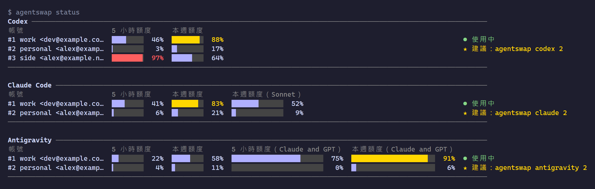

# agentswap

[English](README.md) | 繁體中文 | [简体中文](README.zh-CN.md)

[](https://github.com/WellWells/agentswap/actions/workflows/ci.yml)
[](https://github.com/WellWells/agentswap/releases/latest)
[](LICENSE)

快速、輕巧、隱私優先的帳號切換工具，支援 Codex、Claude Code 與 Antigravity CLI。

有好幾個訂閱時，把登入檔複製來複製去撐不了幾天：存起來的那份很快就過期，重新登入又會把原本在用的帳號登出。agentswap 讓每個已存帳號都維持登入，顯示每個帳號的額度還剩多少，一行指令切換。只換登入，agent 的其他設定都不動。token 只留在你的電腦上，加密保存。



一個小程式，支援 macOS、Linux、Windows。不用另外安裝任何東西，也不常駐背景。

agentswap 的靈感來自 claude-swap（`cswap`），把同樣的做法延伸到 Codex 與 Antigravity CLI。每個已存帳號都加密保存，只有這台電腦的你能打開；整個工具就是一個程式，不需要另外安裝其他東西。如果你要搬過來，`ccswap import` 可以把帳號一起帶過來。

## 安裝

macOS / Linux：

```sh
curl -fsSL https://github.com/WellWells/agentswap/releases/latest/download/install.sh | sh
```

Windows（PowerShell）：

```powershell
irm https://github.com/WellWells/agentswap/releases/latest/download/install.ps1 | iex
```

Homebrew（macOS / Linux）：

```sh
brew install wellwells/tap/agentswap
```

安裝腳本會裝到 `~/.local/bin`（Windows 是 `%LOCALAPPDATA%\agentswap\bin`，並加入 PATH），同時建立 `cxswap`、`ccswap`、`agswap` 等指令，不會跳出要你手動放行的安全提示。`AGENTSWAP_VERSION=v1.0.0` 可以指定版本，`AGENTSWAP_INSTALL_DIR` 可以改安裝資料夾。

用 Go 安裝：`go install github.com/WellWells/agentswap/cmd/agentswap@latest`，再執行 `agentswap link`。

`agentswap update` 會更新到最新版（Homebrew 用 `brew upgrade agentswap`）。有新版時，agentswap 會用一行字提醒你。

## 解除安裝

移除 agentswap 不會登出任何 agent，目前使用中的帳號會維持登入。

**macOS / Linux**（用安裝腳本安裝）：

```sh
agentswap unlink                  # 移除 cxswap、ccswap 等指令
rm ~/.local/bin/agentswap
```

**Homebrew**：

```sh
brew uninstall agentswap
```

**Windows**（PowerShell）：刪除程式資料夾（`cxswap`、`ccswap` 等指令也在裡面），並從使用者 PATH 移除：

```powershell
Remove-Item -Recurse -Force "$env:LOCALAPPDATA\agentswap"
$key = Get-Item HKCU:\Environment
$path = ($key.GetValue('Path', '', 'DoNotExpandEnvironmentNames') -split ';' | Where-Object { $_ -and $_ -ne "$env:LOCALAPPDATA\agentswap\bin" }) -join ';'
Set-ItemProperty HKCU:\Environment Path $path -Type $key.GetValueKind('Path')
```

如果安裝時用 `AGENTSWAP_INSTALL_DIR` 指定了其他資料夾，請改成那個資料夾。

**已存的帳號**會一直保留，直到你自己刪除。有設定 `AGENTSWAP_HOME` 的話，請改刪那個資料夾。

```sh
rm -rf ~/.agentswap                                   # macOS / Linux
```

```powershell
Remove-Item -Recurse -Force "$HOME\.agentswap"        # Windows
```

**加密金鑰**：Windows 不需要另外處理。macOS 和 Linux 的金鑰還留在系統的鑰匙圈裡：

```sh
security delete-generic-password -s agentswap -a vault-key   # macOS
secret-tool clear service agentswap key vault                # Linux
```

## 快速上手

### Codex

```sh
cxswap add work          # 儲存目前登入的帳號
cxswap login personal    # 登入另一個帳號並儲存
cxswap list
```

```text
Codex 帳號

  編號  帳號                         方案  切換指令
  1     work <dev@example.com>       team  ● 使用中
  2     personal <alex@example.org>  plus  cxswap 2
  3     side <alex@example.net>      pro   cxswap 3

切換帳號：`cxswap <編號>`。編號依加入順序排列，移除帳號後，後面的編號會往前遞補。
也可以用別名或 email 切換（`cxswap <別名|email>`）；`cxswap -` 切回上一個帳號。
```

```sh
cxswap 2                 # 切換到 #2
cxswap -                 # 再切回來
```

切換後請重新啟動 Codex；如果 Codex 還在執行，`cxswap` 會詢問要不要幫你關掉。帳號存起來之後，請用 `cxswap login` 新增帳號，不要用 `codex login` 或 `codex logout`，這兩個指令會把目前在用的帳號登出。Codex 設定成把登入資料存在系統鑰匙圈時，目前還不支援。

### Claude Code

```sh
ccswap add work          # 儲存目前登入的帳號
ccswap status
ccswap 2                 # 執行中的工作階段會在下一個請求改用新帳號
```

其他帳號請在 Claude Code 裡用 `/login` 登入，再執行 `ccswap add`。切換只換登入，你的設定和 MCP 伺服器都不會動。只支援 Claude 訂閱登入，不支援 API key。

從 claude-swap 搬過來：

```sh
ccswap import            # 選 1) cswap，或直接執行 `ccswap import 1`
ccswap list              # 確認帳號都搬過來了
cswap purge              # 再移除 claude-swap 留下的副本
```

別名會一起帶過來，已經存過的帳號會略過。搬完之後請不要再用 cswap：兩個工具會刷新同一組登入，互相把對方登出。

### Antigravity CLI

```sh
agswap add work          # 儲存目前登入的帳號
agswap list
agswap 2                 # 會先詢問是否關閉執行中的 agy
```

要新增帳號，在 agy 裡執行 `/logout`，登入另一個帳號後再執行 `agswap add`。登出不會影響已存的帳號。agy 只在啟動時讀取登入，所以 `agswap` 會詢問是否關閉所有執行中的 agy（包括 `agy remote-control`），選否就取消切換。桌面版目前還不支援。

## 指令

| Agent | 指令 |
|---|---|
| OpenAI Codex | `cxswap`、`codexswap`、`agentswap codex` |
| Claude Code | `ccswap`、`claudeswap`、`agentswap claude` |
| Antigravity CLI（`agy`） | `agswap`、`agyswap`、`agentswap antigravity` |

每個 agent 的指令都一樣。`<account>` 可以是 `list` 裡的編號、別名、email，或其中任何不重複的片段。

| 指令 | 說明 |
|---|---|
| `cxswap status [account]` | 顯示所有已存帳號的額度，或只顯示一個，並標出剩餘額度最多的帳號（`usage` 相同） |
| `cxswap list` | 編號、別名、方案，以及目前使用中的帳號 |
| `cxswap <account>` | 切換（也可以寫 `cxswap switch <account>`）；加上 `--yes` 會直接關閉執行中的工作階段，不再詢問 |
| `cxswap -` | 切回上一個帳號 |
| `cxswap add [alias]` | 儲存目前登入的帳號 |
| `cxswap login [alias]` | 僅 Codex：登入另一個帳號並儲存 |
| `ccswap import` | 僅 Claude Code：從 claude-swap 匯入帳號 |
| `cxswap alias <account> [name]` | 設定別名，不給名稱則清除 |
| `cxswap rm <account>` | 移除已存的帳號（不會登出） |
| `agentswap status` | 一次顯示所有 agent |
| `agentswap lang [language]` | 英文（`en`）、繁體中文（`zh-TW`）或簡體中文（`zh-CN`）；`auto` 跟隨系統 |

任何指令不帶參數執行，都會顯示說明。

| 環境變數 | 說明 |
|---|---|
| `AGENTSWAP_HOME` | 已存帳號的位置（預設 `~/.agentswap`） |
| `CODEX_HOME`、`CLAUDE_CONFIG_DIR` | 與 agent 本身的用法相同 |
| `AGENTSWAP_LANG` | 介面語言，優先於 `agentswap lang` |
| `AGENTSWAP_NO_UPDATE_CHECK` | 設定任意值就不檢查新版本 |
| `NO_COLOR` | 不輸出顏色 |

## 隱私

agentswap 沒有伺服器、不用註冊、不收集任何使用資料。它對你的登入資料只做這些事：

- **在你的電腦上**：已存帳號放在 `~/.agentswap`，用只有這台電腦的這個使用者才能解開的金鑰加密，金鑰交給系統保管：Windows 本身、macOS 的鑰匙圈、Linux 的 keyring。檔案複製到別台電腦也打不開。Linux 沒有 keyring 時，agentswap 會改用金鑰檔，並明確告訴你。
- **在網路上**：每個 token 只會送到發給它的那家公司，用來查用量和維持登入：

  | Agent | 連線對象 |
  |---|---|
  | Codex | `chatgpt.com`、`auth.openai.com` |
  | Claude Code | `api.anthropic.com`、`platform.claude.com` |
  | Antigravity CLI | `cloudcode-pa.googleapis.com`、`oauth2.googleapis.com` |

  唯一的其他連線是向 `github.com` 檢查新版本，不帶任何 token。設定 `AGENTSWAP_NO_UPDATE_CHECK=1` 就會關閉。
- **覆寫目前的登入前**，agentswap 會先留一份加密備份，只保留最新五份。
- **開放原始碼**，MIT 授權，不含任何第三方程式碼。

## 參與貢獻

歡迎提問、回報問題和送 pull request。[問題回報表單](https://github.com/WellWells/agentswap/issues/new?template=bug_report.yml)會詢問除錯時通常需要的資訊；想支援其他 agent，可以開一個[功能建議](https://github.com/WellWells/agentswap/issues/new?template=feature_request.yml)。開發與測試方式見 [CONTRIBUTING.md](CONTRIBUTING.md)，可能外洩 token 的安全問題請依 [SECURITY.md](SECURITY.md) 私下回報。Issue 用中文寫也沒問題。

## 授權

Copyright 2026 [WellsTsai](https://wellstsai.com)。[MIT 授權](LICENSE)，另見 [NOTICE](NOTICE)。

agentswap 與 OpenAI、Anthropic、Google 沒有任何關係。
